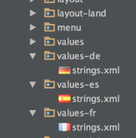

[travis-url]: http://travis-ci.org/#!/jordanjoz1/android-localization-helper
[travis-build-image]: https://secure.travis-ci.org/jordanjoz1/android-localization-helper.svg

[pypi-url]: https://badge.fury.io/py/android-localization-helper
[pypi-image]: https://badge.fury.io/py/android-localization-helper.svg

[downloads-url]: https://pypi.python.org/pypi/android-localization-helper/
[downloads-image]: https://pypip.in/d/android-localization-helper/badge.svg

[arsenal-url]: https://android-arsenal.com/details/1/1367
[arsenal-image]: https://img.shields.io/badge/Android%20Arsenal-android--localization--helper-brightgreen.svg?style=flat

[![Travis build image][travis-build-image]][travis-url]
[![PyPi version][pypi-image]][pypi-url]
[![PyPi download count image][downloads-image]][downloads-url]
[![Android Arsenal][arsenal-image]][arsenal-url]

android-localization-helper
===========================

Python script that checks for missing string translations in your project's localized languages.

Ever lose track of what strings have and haven't been translated in each language? Android Studio [made an awesome GUI](http://tools.android.com/recent/androidstudio087released) to help deal with this issue, but there is no easy way to export missing strings, so if you are missing more than a few strings in a language it can become a tenuous problem. Here's a solution!

This python package will output a directory with all the string translations that are missing for each localized values directory. It can also clean-up localized `strings.xml` to remove translations that are no longer used in the default `strings.xml` file.


## Getting started
Requirements:

* Python >= 2.7.*
* [Standard Android project structure](https://developer.android.com/tools/projects/index.html) for localized values-* folders in `res/` folder



To install run:
```bash
pip install android-localization-helper
```

## Usage

#### Normal use

`cd` into your `res/` folder, and run:

```
android-localization-helper
```

By default, this creates an output directory `to_translate/` ([sample output](./sample_output)) with separate files for the missing strings in each language. Now that you have the untranslated strings for each language in a standard format, you can [send them out for translation](https://developer.android.com/distribute/tools/localization-checklist.html#gp-trans)!

#### Change output directory (--output)
Use the output option to change the output directory path. 

For example, we can output the missing translations into a `to_translate/` directory on the Desktop:

```
android-localization-helper --output ~/Desktop/to_translate
```
  
#### Clean-up translated string files (--clean)
  
This option will remove strings that aren't in the default file and sort strings to match the default `strings.xml` order. **Warning:** *this will overwrite your existing localized `strings.xml` files, so make sure you have a back-up in case of any unexpected changes*
```
android-localization-helper --clean
```

#### Use multiple default string sources (--input)
  
It is recommended that all your translatable strings are in `strings.xml`. If that's not the case, the input option will allow you to include multiple default string source files. The localized output will still have only one file for each language. 

For example, if we had `strings.xml` and `plurals.xml` files in our `values/` directory, we could make sure those are included as part of our default string source:

```
android-localization-helper --input strings.xml plurals.xml
```

### Options

#### -h, --help
Prints help message.

#### --res
Path to the app's /res folder. Like, `./main/res`

By default assumes the current directory

#### --input
List of file names to include from default values directory (e.g. *strings.xml* *plurals.xml*). By default, only *strings.xml* is used

#### --output
Output directory path (directory will be created automatically). Like, `~/Desktop/to_translate`

By default creates *to_translate* folder in the current directory.

#### --clean
Clean the existing `string.xml` files for each language.  This will remove strings that are in the localized language but not in the default language (they presumably got removed from the default langauge).  It will also sort the strings so that they are in the same order as the default language.


## Release History
* 2015-05-31   v0.1.3   support for multiple default string sources
* 2015-01-05   v0.1.2   support for more language folders, better feedback and error handling
* 2015-01-04   v0.1.1   xliff namespace support, better indentation handling
* 2015-01-03   v0.1.0   Initial release

## License

See the [LICENSE](LICENSE) file for license rights and limitations (MIT).
